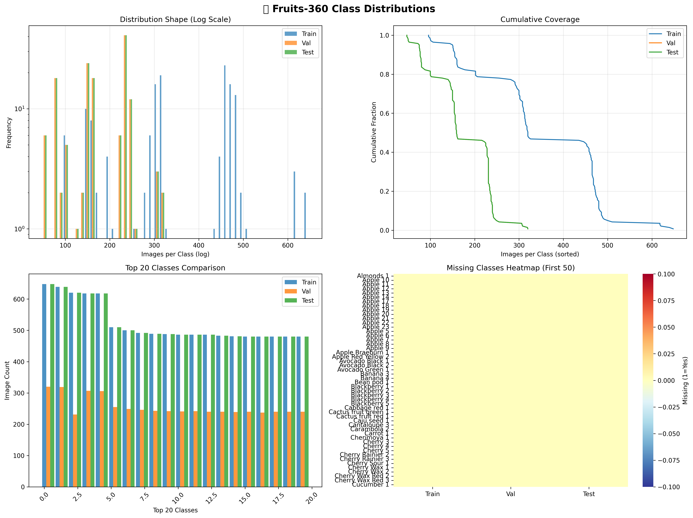

# 🍎 Fruit-360 Classification with VGG16 Transfer Learning

[](https://github.com/dawmro/fruit_classification) [](https://github.com/dawmro/fruit_classification)

**92.0% accuracy** on **full Fruits-360** (137 classes, 23,940 test images). 


## 🎯 Features & Progress

| Version     | Classes | Train  | **Test** | Notebook |
|-------------|---------|--------|----------|--------------|
| **v2.0 Full** | **137** | **98.9%** | **92%** | [Full →](fruit_classification_full_dataset.ipynb) |
| v1.0 Subset       | 24      | 99.2%  | **100%** |  [Subset →](fruit_classification.ipynb) |

- **Custom Head**: (512→256→131 classes)
- **VGG16 Transfer Learning**: Frozen → Fine-tune top-8 layers
- **Two-Phase Training**: Head (92.7%) → Full (99.2% train)
- **Augmentation**: Rotation, zoom, flips for robust generalization
- **Professional Pipeline**: Auto-download, Confusion matrix, Top-k accuracy, prediction grids


## 📁 Structure
```
fruit-classification/
├── fruit_classification_full_dataset.ipynb  # 131 classes (90.5%)
├── fruit_classification.ipynb     # 24 classes (100%)
├── requirements.txt              # Dependencies
├── fruits-360-original-size/     # Dataset (downloaded via notebook)
|   └── fruits-360-original-size/
│       ├── Training/   # 48k imgs, 131 classes
│       ├── Validation/ # 24k imgs 
│       └── Test/       # 24k imgs
├── cm.png                       # Confusion matrix for 24 classes
└── cm_full.png      # Full dataset Confusion matrix
```


## 🛠 Quick Start
1. Create new virtual env:
``` sh
py -3.10 -m venv env
```
2. Activate your virtual env:
``` sh
env/Scripts/activate
```
3. Clone repo
``` sh
git clone https://github.com/dawmro/fruit_classification.git
cd fruit_classification
```
4. Install requirements
```sh
pip install -r requirements.txt
```
5. Run notebook
```sh
# Full 137 classes (90.5%)
jupyter notebook fruit_classification_full_dataset.ipynb
```

## 🔮 Model Architecture
```
VGG16 (14.7M frozen → 1.7M tuned) 
→ GlobalAvgPool → Dense(512+BN+Drop0.5) 
→ Dense(256+BN+Drop0.3) → Dense(131, softmax)
Total: 15.1M params (57MB)
```

## 📈 Results Highlights
Perfect Test Accuracy: 100% on 3,110 test images

Fast Inference: ~20ms/image on CPU

Lightweight: 57MB model size


## 🔬 Technical Details

Dataset: Fruits-360 full (137 classes)

Preprocessing: VGG16-specific + augmentation (rotation=20°, zoom=0.2)

Optimizer: Adam (1e-4 → 1e-5 fine-tune)

Callbacks: EarlyStopping(patience=5), ReduceLROnPlateau(patience=3)

Hardware: Trained on consumer GPU



## 🏆 Limitations & Future Work
Find out why validation set gives only 22% accuracy.

Input Size: 128×128 → Upgrade to 224×224 (+3-5% expected)


## 📝 Citation
```
@misc{oltean2017fruits360,
  author = {Mihai Oltean},
  title = {Fruits-360 dataset},
  year = {2017-},
  howpublished = {\url{https://github.com/fruits-360/fruits-360-original-size}},
  note = {Accessed: 2026-03-08}
}
```
