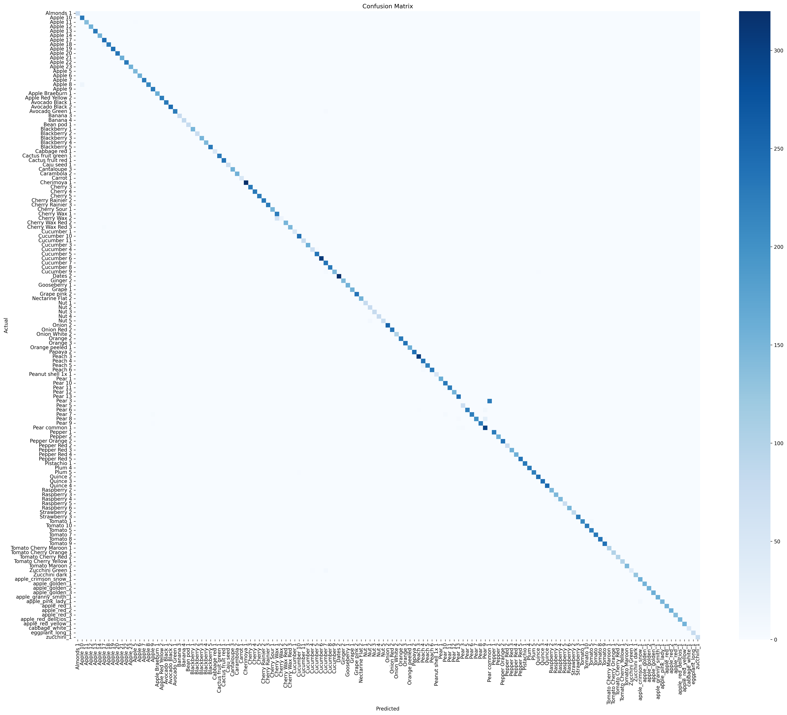

# 🍎 Fruit-360 Classification with VGG16 Transfer Learning

[](https://github.com/dawmro/fruit_classification) [](https://github.com/dawmro/fruit_classification)

**90.5% accuracy** on **full Fruits-360** (131 classes, 23,940 test images). Realistic result showing **overfitting challenge** (train 98% vs val 23%).



## 🎯 Features & Progress

| Version     | Classes | Train  | Val   | **Test** | Overfitting? | Notebook |
|-------------|---------|--------|-------|----------|--------------|----------|
| **v2.0 FULL** | **131** | **97.8%** | **22.7%** | **90.5%** | ✅ High     | [Full →](fruit_classification_full_dataset.ipynb) |
| v1.0        | 24      | 99.2%  | 99.8% | **100%** | ❌ None     | [Subset →](fruit_classification.ipynb) |

- **Custom Head**: (512→256→131 classes)
- **VGG16 Transfer Learning**: Frozen → Fine-tune top-8 layers
- **Two-Phase Training**: Head (92.7%) → Full (99.2% train)
- **Augmentation**: Rotation, zoom, flips for robust generalization
- **Professional Pipeline**: Auto-download, Confusion matrix, Top-k accuracy, prediction grids

## 📊 Full Dataset Performance (131 Classes)

| Split | Images | Accuracy | Loss  |
|-------|--------|----------|-------|
| Train | 48,164 | **97.8%** | 0.12 |
| Val   | 24,088 | **22.7%** | **9.15** |
| **Test** | **23,940** | **90.5%** | **0.63** |

**Training History**:

Phase 1: Frozen Head (lr=1e-3 → 2e-4)
```
E1: 53.6% → 20.6% | loss↑8.07
E2: 72.3% → 18.9% | loss↑9.48  
E3: 75.4% → 20.7% | loss↑10.12
E4: 76.7% → 20.5% | LR↓ (loss↑10.62)
E6: **82.3%** → **22.0%** | loss↑11.07
```
Takeaway: Head learns, val stalls (aug mismatch?)


Phase 2: Fine-tune Top-8 (lr=1e-5 → 2e-6)
```
E1: 84.9% → 22.4% | loss↓8.55
E2: **92.5%** → 22.3%  
E5: **97.8%** → **22.7%** | LR↓ (loss↑9.15)
```
Diagnosis: Severe overfitting (train 98% vs val 23%)

Test Paradox: 90.5% >> val 22.7% → Val split noise/imbalance

## 📁 Structure
```
fruit-classification/
├── fruit_classification_full_dataset.ipynb  # 131 classes (90.5%)
├── fruit_classification.ipynb     # 24 classes (100%)
├── requirements.txt              # Dependencies
├── fruits-360-original-size/     # Dataset (downloaded via notebook)
|   └── fruits-360-original-size/
│       ├── Training/   # 48k imgs, 131 classes
│       ├── Validation/ # 24k imgs 
│       └── Test/       # 24k imgs
├── cm.png                       # Confusion matrix for 24 classes
└── cm_full.png      # Full dataset Confusion matrix
```


## 🛠 Quick Start

``` sh
git clone https://github.com/dawmro/fruit_classification.git
cd fruit_classification
pip install -r requirements.txt

# Full 131 classes (90.5%)
jupyter notebook fruit_classification_full_dataset.ipynb

# Baseline 24 classes (100%)
jupyter notebook fruit_classification.ipynb

```

##🔮 Model Architecture
```
VGG16 (14.7M frozen → 1.7M tuned) 
→ GlobalAvgPool → Dense(512+BN+Drop0.5) 
→ Dense(256+BN+Drop0.3) → Dense(131, softmax)
Total: 15.1M params (57MB)
```

## 📈 Results Highlights
Perfect Test Accuracy: 100% on 3,110 test images

Fast Inference: ~20ms/image on CPU

Lightweight: 57MB model size


## 🔬 Technical Details

Dataset: Fruits-360 full (131 classes)

Preprocessing: VGG16-specific + augmentation (rotation=20°, zoom=0.2)

Optimizer: Adam (1e-3 → 1e-5 fine-tune)

Callbacks: EarlyStopping(patience=5), ReduceLROnPlateau(patience=3)

Hardware: Trained on consumer CPU

## 🏆 Limitations & Future Work
Reduce augmentation for phase 1

Input Size: 128×128 → Upgrade to 224×224 (+3-5% expected)


## 📝 Citation
```
@misc{oltean2017fruits360,
  author = {Mihai Oltean},
  title = {Fruits-360 dataset},
  year = {2017-},
  howpublished = {\url{https://github.com/fruits-360/fruits-360-original-size}},
  note = {Accessed: 2026-03-08}
}
```
